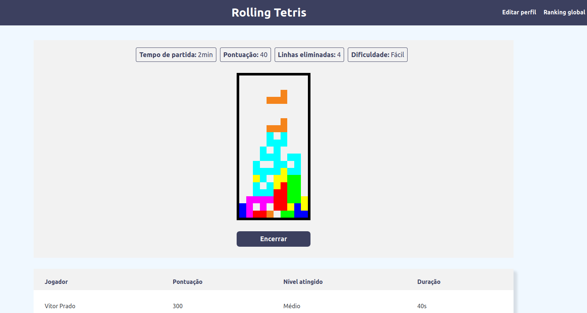

<div align="center">
  <h1>🧱 Rolling Tetris</h1>
</div>

<div align="center">
  
</div>

#####

<p align="center">An instance of the game Tetris built with JavaScript</p>

## 🛠️ Technologies

<ul>
  <li><a href="https://www.javascript.com/">JavaScript</a></li>
</ul>

## ⚙️ Requirements

<ul>
  <li><a href="https://git-scm.com/">Git</a></li>
</ul>

## 🚀 Installation

```bash
$ git clone https://github.com/gabrielsanttana/rolling-tetris
```

To run the game, it's necessary to have a HTTP server to be able to open the `src/containers/Game/index.html` file.

Example with Python 3:

```bash
$ cd src/containers/Game
$ python -m http.server 8000
$ python -m SimpleHTTPServer 8000
```
